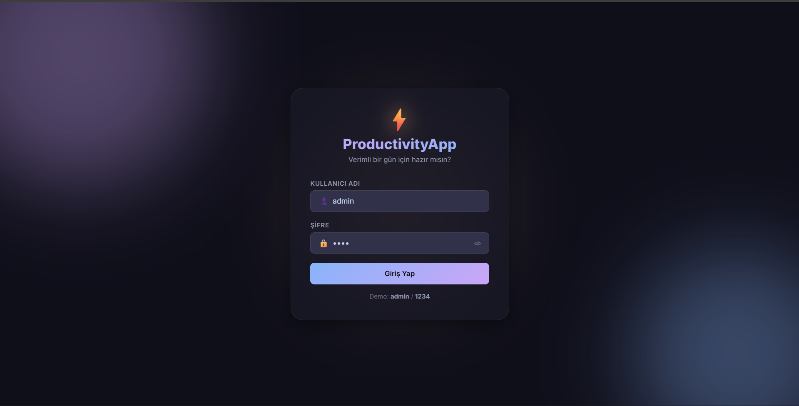
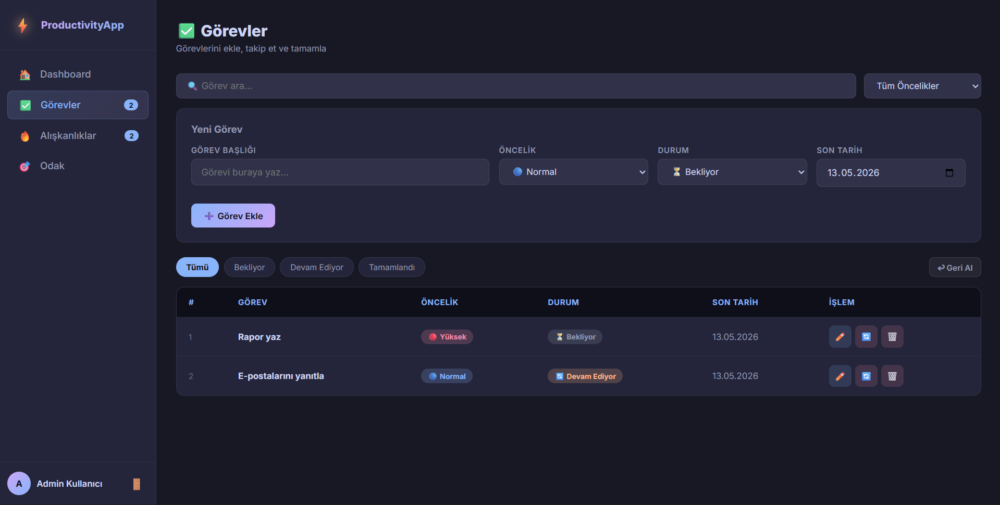
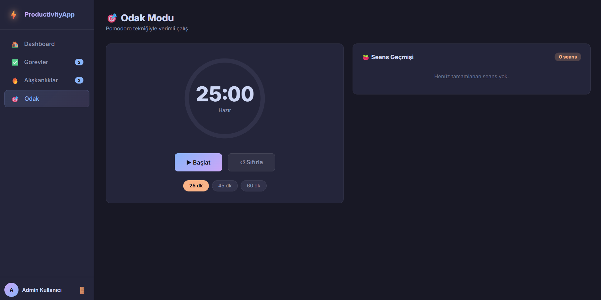
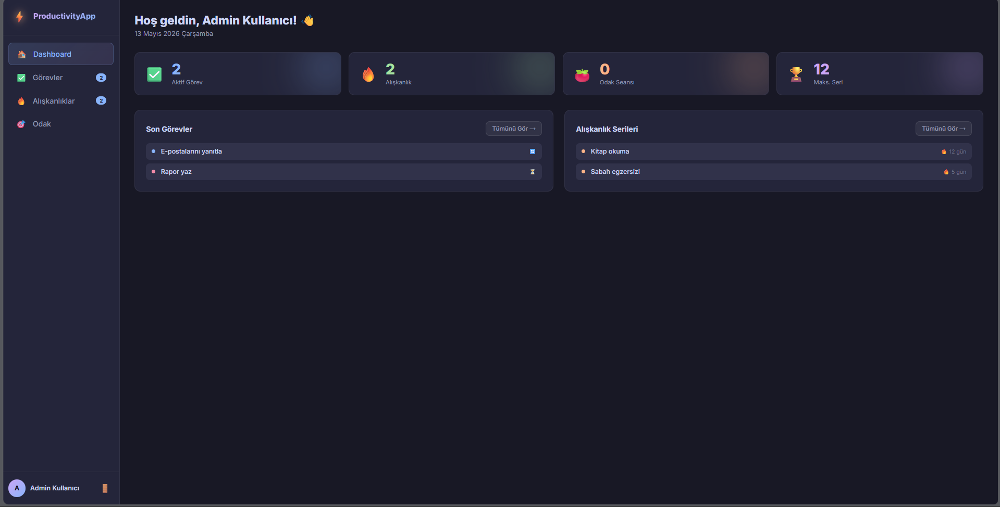
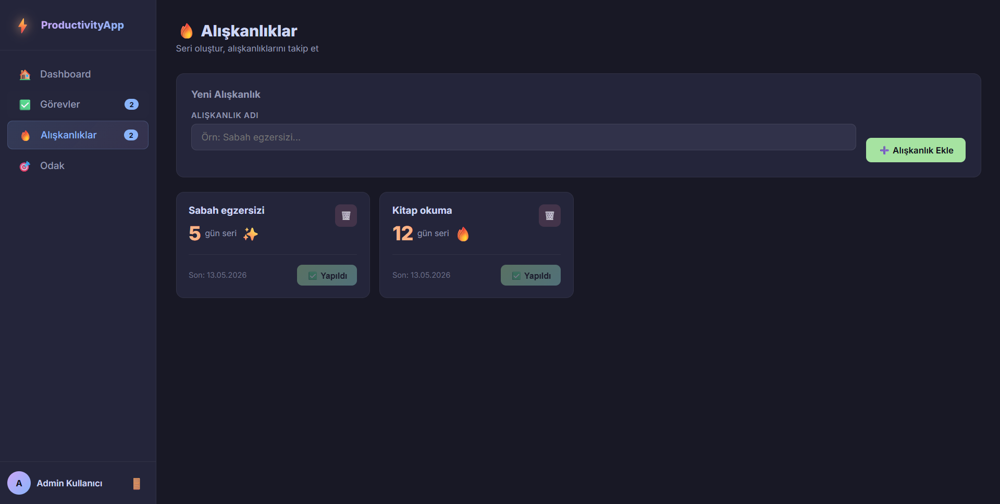

# ⚡ ProductivityApp

**Web Tabanlı Kişisel Verimlilik Uygulaması**

## 📌 Proje Hakkında

ProductivityApp; görev yönetimi, alışkanlık takibi ve Pomodoro tekniğiyle odaklanma seansı olmak üzere üç temel modülü tek çatı altında birleştiren kişisel verimlilik uygulamasıdır.

Proje iki sürümden oluşmaktadır:

- **C# Windows Forms** — Masaüstü uygulaması, SQLite tabanlı kalıcı veri saklama
- **Web Sürümü** — Saf HTML / CSS / Vanilla JavaScript, LocalStorage tabanlı kalıcı veri saklama

---

## 📸 Ekran Görüntüleri

| Giriş ve Dashboard | Görevler ve Alışkanlıklar | Odak |
|:---:|:---:|:---:|
|  <br> *Kullanıcı Girişi* |  <br> *Görev Yönetimi* |  <br> *Pomodoro Seansı* |
|  <br> *Genel Bakış (Dashboard)* |  <br> *Alışkanlık Takibi* | |

---

## ✨ Özellikler

### ✅ Görev Yönetimi
- Görev ekleme (başlık, öncelik, durum, son tarih)
- Canlı arama (büyük/küçük harf duyarsız)
- Öncelik ve durum filtreleme
- Görev güncelleme (düzenleme modu)
- Görev silme + `Stack` tabanlı Geri Al

### 🔥 Alışkanlık Takibi
- Alışkanlık ekleme ve silme
- Günlük kontrol ile Streak (seri) sayacı
- Arka arkaya gün hesaplama mantığı

### 🎯 Odak / Pomodoro
- 25 / 45 / 60 dakika seçilebilir süre
- Başlat / Duraklat / Sıfırla kontrolü
- SVG animasyonlu halka zamanlayıcı
- Tamamlanan seans geçmişi

### 🏠 Dashboard
- Aktif görev, alışkanlık, seans ve maksimum seri istatistikleri
- Son eklenen görev ve alışkanlık önizlemeleri

---

## 🗂️ Proje Yapısı

```text
productivity-app/
├── Screenshots/                # Uygulama ekran görüntüleri
├── Database/
│   └── DatabaseHelper.cs       # SQLite CRUD işlemleri
├── Forms/
│   ├── LoginForm.cs/.Designer.cs
│   ├── MainForm.cs/.Designer.cs
│   ├── TaskForm.cs/.Designer.cs
│   ├── HabitForm.cs/.Designer.cs
│   └── FocusForm.cs/.Designer.cs
├── Helpers/
│   └── AppTheme.cs             # Renk, font ve stil sabitleri
├── Models/
│   ├── User.cs
│   ├── TaskItem.cs
│   ├── Habit.cs
│   └── FocusSession.cs
├── web/
│   ├── index.html              # Web sürümü — tek sayfa uygulama
│   ├── style.css
│   └── app.js
├── Program.cs
└── ProductivityApp.csproj
```
---

## 🛠️ Kullanılan Teknolojiler

| Katman | Teknoloji |
|---|---|
| Masaüstü UI | C# .NET 8 · Windows Forms |
| Web UI | HTML5 · CSS3 · Vanilla JavaScript |
| Veritabanı | SQLite (`Microsoft.Data.Sqlite 8.0.0`) |
| Web Veri | Browser LocalStorage API |
| Tema | `AppTheme.cs` — Catppuccin Mocha paleti |

---

## 🧩 Kullanılan Collection Yapıları

| Yapı | Kullanım Yeri | Amaç |
|---|---|---|
| `List<TaskItem>` | `TaskForm.cs` | Görevleri bellekte tutar, DataGridView'a bağlanır |
| `List<Habit>` | `HabitForm.cs` | Alışkanlık listesi |
| `List<FocusSession>` | `FocusForm.cs` | Tamamlanan seans geçmişi |
| `Stack<T>` *(web)* | `app.js` | Silinen görevleri saklar; Geri Al ile geri getirir |
| `Dictionary` *(web)* | `app.js` | Öncelik/durum değerlerini CSS sınıfı ve emoji ile eşleştirir |
| `string[]` | `TaskForm.cs` | ComboBox seçeneklerini toplu ekler |

---

## 🖥️ Kurulum ve Çalıştırma

### Windows Forms Sürümü

```bash
# Gereksinimler: .NET 8 SDK
cd productivity-app
dotnet restore
dotnet run
```

> Giriş: `admin` / `1234`

### Web Sürümü

`web/index.html` dosyasını herhangi bir modern tarayıcıda açın.  
Sunucu gerekmez — tüm veriler LocalStorage'da saklanır.

> Giriş: `admin` / `1234`


